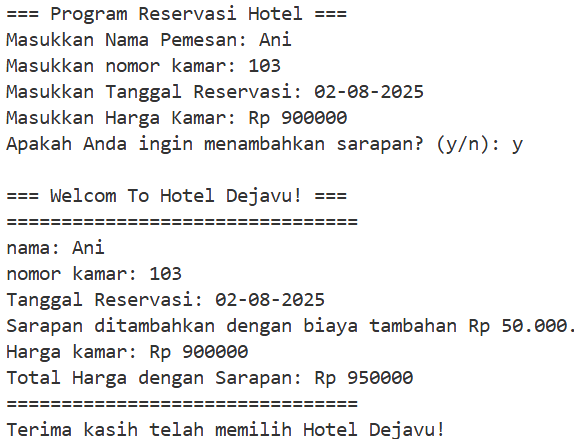

# TUGAS 1 BIKIN PROGRAM WAJIB MENGGUNAKAN IF
## Program Jam Datang Siswa
Program ini adalah program sederhana untuk memudahkan admin mendata siswa yang datang tepat waktu atau datang terlambat  berbasis.

### Tipe Data & Variabel Yang Digunakan
```cpp
string nama, kelas;
float jam;
```

### Cara Kerja Program
1. Admin diminta memasukkan data siswa (Nama, Kelas, Jam Datang).
```cpp
cout << "=== program jam datang siswa ===\n";
cout << "Masukkan Nama Siswa: ";
getline(cin, nama);
cout << "Masukkan Kelas Siswa: ";
getline(cin, kelas);            
cout << "Masukkan Jam Datang Siswa: ";
cin >> jam;
cout << "=================================\n";
```

2. Jika siswa datang jam kurang dari samadengan 7.30 maka siswa datang tepat waktu. <br>
   Jika siswa datang jam lebih dari samadengan 7.30 maka siswa datang terlambat.
```cpp
if (jam <= 7.30) {
    cout << "siswa " << nama << " dari kelas " << kelas << " datang tepat waktu.\n";
} else {
    cout << "siswa " << nama << " dari kelas " << kelas << " datang terlambat.\n";
}
```

### Output
 <br>


=======================================================================================================================================================================
# TUGAS 2 BIKIN PROGRAM WAJIB MENGGUNAKAN SWITCH
## Program Reservasi Hotel
Program ini adalah program reservasi hotel sederhana berbasis bahasa c++ untuk memudahkan admin mendata pemesan.

### Tipe Data & Variabel Yang Digunakan
```cpp
string nama, nomor, tanggal;
    int harga, total;
    char pilihan;
```

### Cara Kerja Program
1. Admin diminta menginput data dari pemesan (Nama, Nomor Kamar, Tanggal, Harga dan memberikan pilihan apakah pemesan ingin menambahkan sarapan atau tidak) jika pemesan memilih menambahkan sarapan, admin harus ketik y dan jika pemesan memilin tidak menambahkan sarapan, maka admin ketik n.
```cpp
cout << "=== Program Reservasi Hotel ===\n";
    cout << "Masukkan Nama Pemesan: ";
    getline(cin, nama);
    cout << "Masukkan nomor kamar: ";
    getline(cin, nomor);
    cout << "Masukkan Tanggal Reservasi: ";
    getline(cin, tanggal);
    cout << "Masukkan Harga Kamar: Rp ";
    cin >> harga;
    cout << "Apakah Anda ingin menambahkan sarapan? (y/n): ";
    cin >> pilihan;
```

2. Jika pemesan memilih menambahkan sarapan maka akan ada biaya tambahan 50.000 ribu dan akan dihitung otomasis menggunakan total = harga + 50000;
```cpp
switch (pilihan) {
    case 'y':
        cout << "\n=== Welcom To Hotel Dejavu! ===\n";
        cout << "================================\n";
        cout << "nama: " << nama << endl;
        cout << "nomor kamar: " << nomor << endl;
        cout << "Tanggal Reservasi: " << tanggal << endl;
        cout << "Sarapan ditambahkan dengan biaya tambahan Rp 50.000\n";
        cout << "Harga kamar: Rp " << harga << endl;
        total = harga + 50000; 
        cout << "Total Harga dengan Sarapan: Rp " << total << endl; 
        cout << "================================\n";
        cout << "Terima kasih telah memilih Hotel Dejavu!\n";
        break;
```

3. jika pemesan memilih tidak menambahkan pesanan maka muncul dengan harga tetap dari data yang sudah di isi.
```cpp
case 'n':
    cout << "\n=== Welcom To Hotel Dejavu! ===\n";
    cout << "================================\n";
    cout << "nama: " << nama << endl;
    cout << "nomor kamar: " << nomor << endl;
    out << "Tanggal Reservasi: " << tanggal << endl;
    cout << "Sarapan tidak ditambahkan.\n";
    cout << "Total Harga: Rp " << harga << endl;
    cout << "================================\n";
    cout << "Terima kasih telah memilih Hotel Dejavu!\n";
    break;
```

4. jika admin mengetik selain hurup y atau n maka yg keluar adalah pilihan tidak valid.
```cpp
default:
    cout << "Pilihan tidak valid.\n";
```

### Output
 <br>

